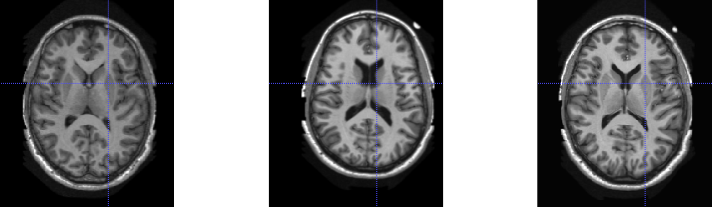
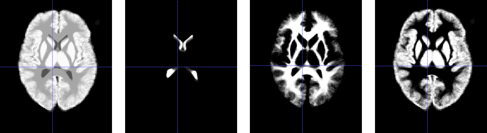
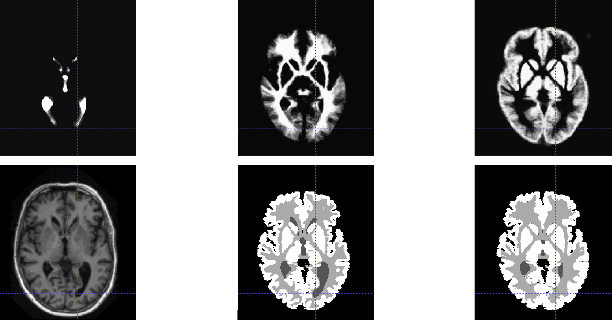
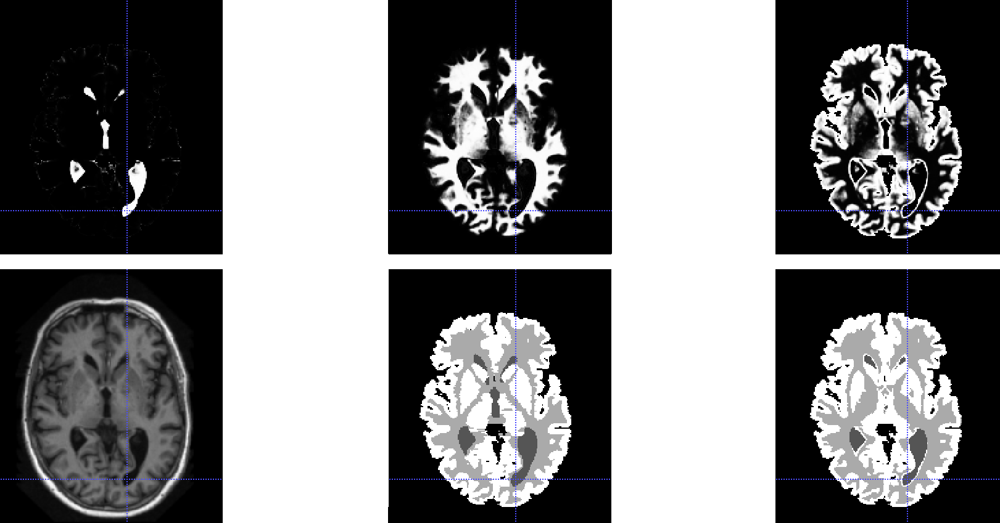

# Atlas-Based 3D Brain Segmentation in T1 MRI

**Problem Statement**: Fully supervised, multi-class 3D brain segmentation in T1 MRI.

**Data**: *Label 1*: Cerebrospinal Fluid (CSF); *Label 2:* White Matter (WM); *Label 3:* Gray Matter (GM). 

**Directories**  
  ● Register NIfTI Training Volumes to Reference Volume: `elastix-scripts/register_train.bat`  
  ● Transform NIfTI Training Labels to Reference Space: `elastix-scripts/transform_train.bat`  
  ● Register Training Reference Volume to NIfTI Testing Volumes: `elastix-scripts/register_test.bat` 
  ● Transform Training Probabilistic Atlas to NIfTI Testing Labels: `elastix-scripts/transform_test.bat`  
  ● Register MNI Template Volume to NIfTI Testing Volumes: `elastix-scripts/register_test.bat` 
  ● Transform MNI Atlas to NIfTI Testing Labels: `elastix-scripts/transform_test.bat`  
  ● Perform Segmentation Algorithms: `scripts/prime.py`  
  

## Affine and B-Spline Registration (via elastix-5)  
  
  
*Figure 1.  [left-to-right]: T1 MRI volume of the reference image (patient1000), the moving image (patient1006) and the registered image (patient1006) using 3D affine and B-spline registration with gradient descent optimizer and Mattes mutual information metric (optimized from -0.355940 to -0.739491). Blue cross-hairs mark the same voxel across all 3 volumes at slice 135, verifying successful registration.*  
  
    
    
## Probabilistic Atlases  
  
  
*Figure 2.  [left-to-right]: Mean segmentation ground truth for all 15 registered training labels, the CSF probabilistic atlas, the WM probabilistic atlas and the GM probabilistic atlas. Blue cross-hairs mark the same voxel across all 4 volumes at slice 135 with 0.13335, 0.06665, 0.80000 probabilities of belong to the CSF, WM and GM classes, respectively.*  
  
    
    
## Tissue Models  
  
  
*Figure 3.  [left-to-right]: Independent tissue models (where the area under each curve is equal to 1) and functional tissue models (where sum of the normalized frequency values/probabilities for all 3 classes at any given intensity value is equal to 1). Anomalous values appear in the functional tissue models after the intensity value 2000, owing to division by very small probabilities values.*

## Segmentation via Label Propagation  
  
  
*Figure 4.  [top row, left-to-right]: CSF, WM and GM probabilistic atlas for patient 1125. [bottom row, left-to-right]: T1 MRI volume, ground truth segmentation and predicted segmentation via label propagation for patient 1125. Blue cross-hairs mark the same voxel across all 4 volumes at slice 130, highlighting the site of an abnormality that is not accounted for in the probabilistic atlas and is subsequently poorly segmented in the predicted mask.*

## Segmentation via Label Propagation with Tissue Models  
  
  
*Figure 5.  [top row, left-to-right]: CSF, WM and GM tissue models-based intensity atlas for patient 1125, showing the different class probabilities for intensity values across the volume. [bottom row, left-to-right]: T1 MRI volume, ground truth segmentation and predicted segmentation via label propagation with tissue models for patient 1125. Blue cross-hairs mark the same voxel across all 4 volumes at slice 130, highlighting the site of an abnormality that is accounted for in the intensity atlas and is subsequently accurately segmented in the predicted mask.*

## Segmentation via EM Algorithm (with Training Probabilistic Atlas)  
  
  
*Figure 6.  a) T1 MRI testing volume (patient 1038). b) Segmentation ground truth of testing volume (patient 1038). c) Segmentation using label propagation. d) EM segmentation initialized by K-Means. e) EM segmentation initialized by label propagation. f) Joint EM-atlas segmentation. Blue cross-hairs mark the same voxel across all 4 volumes at slice 140, highlighting the site of putamen structures in GM.*

## Segmentation via EM Algorithm (with MNI Atlas)  
  
  
*Figure 7. a) T1 MRI testing volume (patient 1038). b) Segmentation ground truth of testing volume (patient 1038). c) Segmentation using label propagation with MNI probabilistic atlas. d) Segmentation using label propagation with MNI atlas and tissue models. e) EM segmentation initialized by MNI atlas. f) Joint EM-MNI atlas segmentation. Blue cross-hairs mark the same voxel across all 4 volumes at slice 140, highlighting the site of putamen structures in GM.*

## Experimental Results  
  
  
*Figure 8.  Box plot of all 9 segmentation algorithms investigated. {A1: Label Propagation; A2: Label Propagation with Tissue Models; A3: Label Propagation (MNI); A4: Label Propagation (MNI) with Tissue Models; B1: EM with K-Means Initialization; B2: EM with Atlas Initialization; B3: Joint EM-Atlas Computation; B4: EM with MNI Atlas Initialization; B5: Joint EM-MNI Atlas Computation.}*
